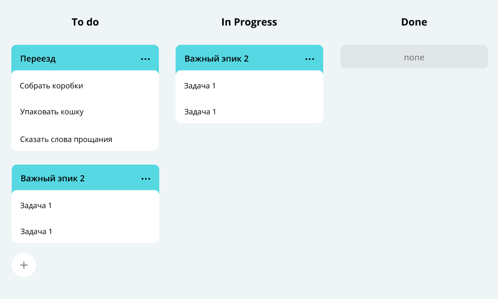
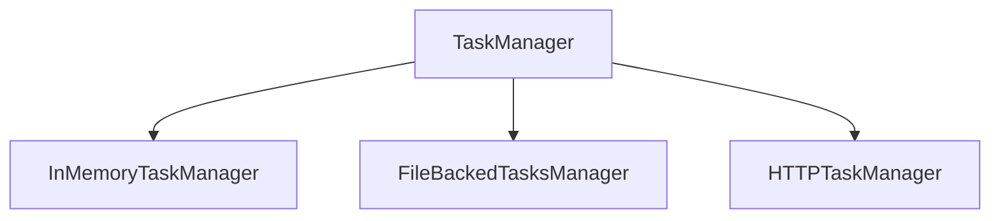

# Трекер задач

---

### Описание

Менеджер для управления совместной работой над задачами. Программа отвечает за формирование модели данных для следующей страницы:

Таск-менеджер позволяет хранить задачи в памяти, в файле или в симуляции БД в зависимости от реализации:

- InMemoryTaskManager - хранит состояние менеджера в оперативной памяти
- FileBackedTasksManager - сохраняет все задачи и состояние менеджера в файл
- HTTPTaskManager - сохраняет все задачи и состояние в KVServer (Симуляция БД)

### Функционал:
- получение задачи по идентификатору
- получение списка задач с сортировкой по времени
- получение списка подзадач определенного эпика
- получение истории состояния задач с сортировкой по времени
- получение списка задач по приоритету
- создание задачи, обновление, удаление задачи
- управление статусом задачи
- сохранение состояния задач и истории просмотров в памяти или в файл (в зависимости от используемого менеджера задач)
- восстановление состояния задач и истории просмотров из памяти или файла (в зависимости от используемого менеджера задач)

###

| Метод  | Эндпоинт                          | Описание                                        |
|--------|-----------------------------------|-------------------------------------------------|
| POST   | /tasks/task Body: {task...}       | Создание задачи                                 |
| POST   | /tasks/epic Body: {epic...}       | Создание эпика                                  |
| POST   | /tasks/subtask Body: {subtask...} | Создание подзадачи                              |
| GET    | /tasks/task                       | Получение всех задач                            |
| GET    | /tasks/task/?id=                  | Получение задачи по идентификатору              |
| GET    | /tasks                            | Получение задач по приоритету                   |
| GET    | /tasks/subtask/epic/?id=          | Получение всех подзадач по идентификатору эпика |
| GET    | /tasks/history                    | Получение истории состояния задач               |
| GET    | /tasks/epic                       | Получение всех эпиков                           |
| GET    | /tasks/epic/?id=                  | Получение эпика по идентификатору               |
| GET    | /tasks/subtask                    | Получение всех подзадач                         |
| GET    | /tasks/subtask/?id=               | Получение подзадачи по идентификатору           |
| DELETE | /tasks                            | Удаление всех задач включая эпики и подзадачи   |
| DELETE | /tasks/task                       | Удаление всех задач типа TASK                   |
| DELETE | /tasks/task/?id=                  | Удаление задачи типа TASK по идентификатору     |
| DELETE | /tasks/epic                       | Удаление всех типа EPIC                         |
| DELETE | /tasks/epic/?id=                  | Удаление задачи типа EPIC по идентификатору     |
| DELETE | /tasks/subtask                    | Удаление всех типа SUBTASK                      |
| DELETE | /tasks/subtask?id=                | Удаление задачи типа SUBTASK по идентификатору  |

### Стек:
- Java 11
- Gson
- Junit 5