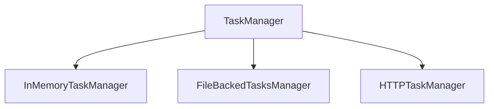

# Трекер задач

---

### Описание

Менеджер для управления совместной работой над задачами. Программа отвечает за формирование модели данных для следующей страницы:

#### Типы задач:
- TASK - обычные задачи
- EPIC - большая задача, которая делится на подзадачи
- SUBTASK - подзадачи входящие в EPIC

#### Таск-менеджер позволяет хранить задачи и состояние в памяти, в файле или в симуляции БД в зависимости от реализации:

- InMemoryTaskManager - хранит состояние менеджера в оперативной памяти
- FileBackedTasksManager - сохраняет задачи и состояние менеджера в файл
- HTTPTaskManager - сохраняет задачи и состояние менеджера в симуляцию БД (KVServer)

### Функционал

- создание, обновление и удаление задач, эпиков и подзадач
- получение конкретной задачи, епика или подзадачи
- получение списка задач, епиков или подзадач с сортировкой по времени
- получение списка подзадач конкретного эпика с сортировкой по времени
- получение списка задач по приоритету времени
- получение истории просмотров задач с сортировкой по времени
- управление статусом задачи
- сохранение состояния задач и истории просмотров в память, файл или БД
- восстановление состояния задач и истории просмотров из памяти, файла или БД

###

| Метод  | Эндпоинт                          | Описание                                                   |
|--------|-----------------------------------|------------------------------------------------------------|
| POST   | /tasks/task Body: {task...}       | Создание/обновление задачи TASK                            |
| POST   | /tasks/epic Body: {epic...}       | Создание/обновление задачи EPIC                            |
| POST   | /tasks/subtask Body: {subtask...} | Создание/обновление задачи SUBTASK                         |
| GET    | /tasks/task                       | Получение всех задач                                       |
| GET    | /tasks/task/?id=                  | Получение задачи TASK по идентификатору                    |
| GET    | /tasks                            | Получение задач по приоритету                              |
| GET    | /tasks/subtask/epic/?id=          | Получение всех задач SUBTASK по идентификатору задачи EPIC |
| GET    | /tasks/history                    | Получение истории состояния задач                          |
| GET    | /tasks/epic                       | Получение всех задач EPIC                                  |
| GET    | /tasks/epic/?id=                  | Получение задачи EPIC по идентификатору                    |
| GET    | /tasks/subtask                    | Получение всех задач SUBTASK                               |
| GET    | /tasks/subtask/?id=               | Получение задачи SUBTASK по идентификатору                 |
| DELETE | /tasks                            | Удаление всех задач                                        |
| DELETE | /tasks/task                       | Удаление всех задач TASK                                   |
| DELETE | /tasks/task/?id=                  | Удаление задачи TASK по идентификатору                     |
| DELETE | /tasks/epic                       | Удаление всех задач EPIC                                   |
| DELETE | /tasks/epic/?id=                  | Удаление задачи EPIC по идентификатору                     |
| DELETE | /tasks/subtask                    | Удаление всех задач SUBTASK                                |
| DELETE | /tasks/subtask?id=                | Удаление задачи SUBTASK по идентификатору                  |

### Стек:
- Java 11
- Gson
- Junit 5